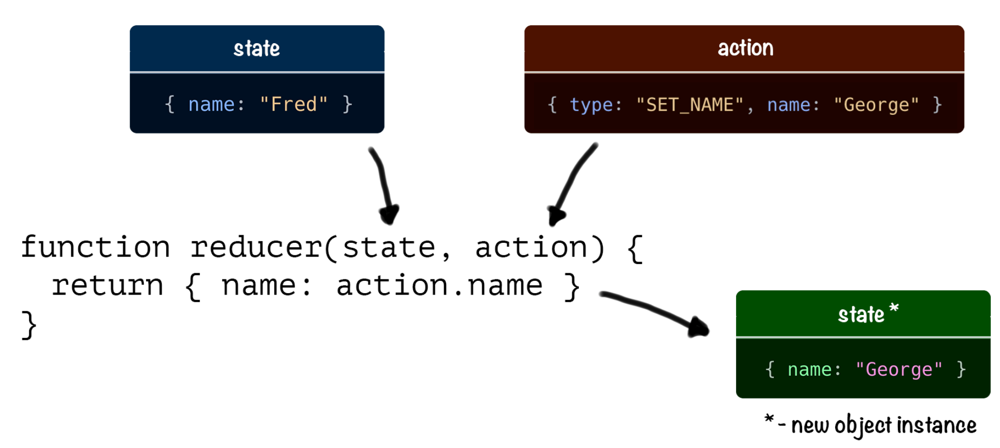

useReducer is a React hook that allows us to manage complex state-like objects
with multiple fields.

The main idea is that instead of mutating the original object we always create a
new instance with desired values.

<div style="text-align:center">

<h3>Instead of mutating the object we create a new instance</h3>
</div>

<br />

The state is updated using a special function called <i>reducer</i>. <br />

## What Is a Reducer?

A reducer is a function that calculates a new state by combining an old state
with an action object.

<br />

<div style="text-align:center">

<h3>Reducer</h3>
</div>

<br />

Reducer must be a pure function. It means it shouldn’t produce any side effects
(I/O operations or modifying global state) and for any given input it should
return the same output. Usually a reducer looks like this:

```
function exampleReducer(state, action) {
  switch (action.type) {
    case "SOME_ACTION": {
      return { ...state, updatedField: action.payload };
    }
    default:
      return state;
  }
}
```
